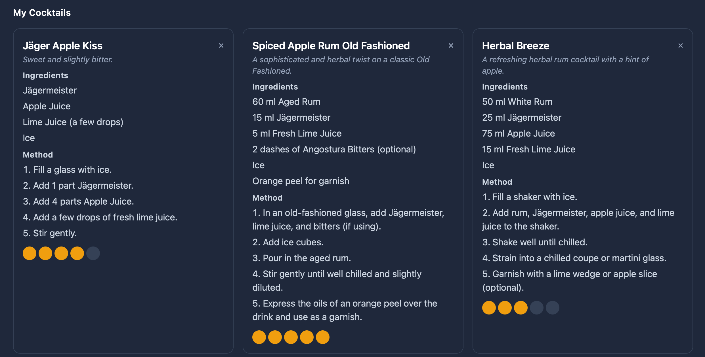
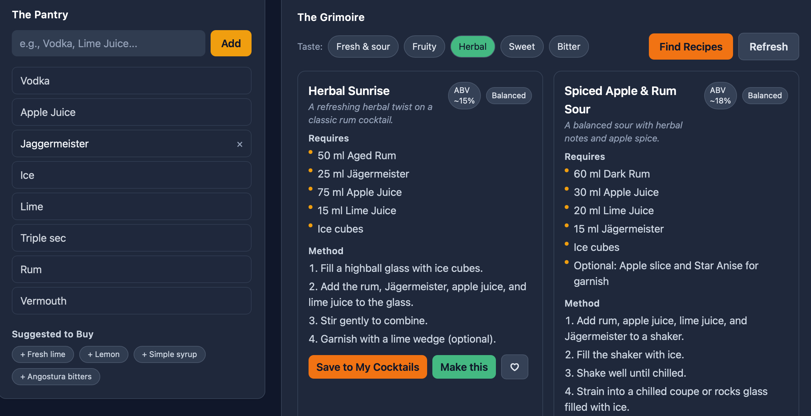

# Alchemy Bar – AI Cocktail Finder

Taste-driven cocktail suggestions powered by AI. Build your pantry, pick how you want a drink to taste, and get two curated, metric-only recipes. Save favorites, rate, and keep a short “Recently Made” list.

[Live Demo →](https://cocktailsguide-c1907.web.app)

---

## Preview

---

## Features

- Taste-first discovery
  - Pick chips like “Fruity”, “Herbal”, “Sweet”, “Fresh & sour”
  - Always metric (ml / parts), Europe-friendly
  - Exactly two recipes per fetch (clean browsing)
- Smart engine
  - Considers your pantry (without forcing all ingredients)
  - Learns from ratings and your taste chip choices
- Personal bar
  - Firestore-backed Inventory (add/remove)
  - Save to My Cocktails, rate 1–5
  - Favorites with one-tap heart
  - Recently Made (latest 5; delete any)
- Polished UI
  - TailwindCSS with Jägermeister-inspired theme
  - Subtle animations and consistent badges (ABV / Sweetness)

---

App source lives elsewhere; try it live here:
- [Open the app](https://cocktailsguide-c1907.web.app)

---

## How It Works (High level)

- Frontend: React + Vite + Tailwind
- Auth & Data: Firebase Auth + Firestore
  - `users/{uid}` holds preferences and filters
  - `users/{uid}/cocktails` stores saved recipes and ratings
  - `users/{uid}/favorites` stores hearted items
  - `users/{uid}/history` tracks “Recently Made”
- AI: Google Gemini
  - Prompt enforces metric-only units
  - Always returns two recipes
  - Uses a sensible subset of your pantry, not all at once
  - We parse JSON from the model response (no markdown)

---

## Roadmap

- More taste chips (smoky, spicy, floral)
- Dietary tags (egg-free, dairy-free)
- Shareable links for a recipe
- ABV and sweetness filters as advanced drawer
- Offline pantry (local cache) for quick edits

---

## Privacy

- Email/password auth with Firebase
- Your pantry and saved items live in your Firestore account
- AI requests include your selected taste and pantry context
- No ads, no selling data

---

## Tech Stack

- React 18, Vite 5
- Tailwind CSS 4
- Firebase (Auth, Firestore, Hosting)
- Google Gemini API

---

## Links

- Live app: https://cocktailsguide-c1907.web.app
- Issues / feedback: open an issue on this docs repo

---

## Credits

Built with a love for cocktails and clean UX. Cheers! 🍸
